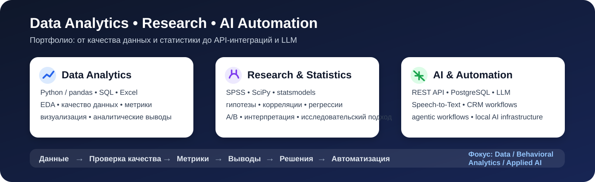
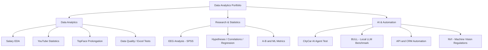

# Data Analytics Portfolio

  

Портфолио проектов по аналитике данных и AI: Python, SQL, Excel, SPSS, статистика, очистка данных, расчёт метрик, API-интеграции, LLM и формализация требований для систем компьютерного зрения.

## Стек

## О чём это портфолио

- **Аналитика данных:** очистка, EDA, расчёт метрик, проверка качества данных, визуализация и интерпретация результатов.
- **Статистика и исследования:** проверка гипотез, корреляции, регрессии, A/B, SPSS и работа с исследовательскими данными.
- **AI и автоматизация:** REST API, PostgreSQL, LLM, CRM-интеграции, Speech-to-Text и проектирование AI-workflows.
- **Computer Vision и процессы:** работа с неструктурированной технической информацией, формализация требований, чек-листы, BPMN и перевод логики машинного зрения в понятные рабочие регламенты.

## Карта портфолио

**Вектор развития:** Data Analyst → Behavioral Analytics → Applied AI / LLM systems. Мой основной интерес - задачи, где данные, поведение пользователей и AI соединяются в одном рабочем процессе.

## Проекты

| Проект | О чём проект | Стек | Результат |
|---|---|---|---|
| [Salary EDA](./salary-eda/) | Анализ учебного датасета о зарплатах: очистка, распределения, факторы дохода, верхний зарплатный дециль | Python, pandas, Matplotlib, Seaborn, statsmodels | Подготовлена очищенная выборка, построены визуализации и OLS-модели, описан профиль верхних зарплат |
| [Global YouTube Statistics Analysis](./youtube-statistics-analysis/) | EDA и статистический анализ популярных YouTube-каналов: пропуски, распределения, корреляции, линейная и логистическая регрессия | Python, pandas, SciPy, scikit-learn, Matplotlib, Seaborn, missingno | Сравнены Pearson/Spearman, проведена диагностика остатков, классификация оценена по accuracy и macro F1 с stratify и baseline |
| [Horse Colic Data Quality EDA](./horse-colic-eda/) | Проверка качества табличного датасета: коды категорий, пропуски, выбросы, стратегия заполнения | Python, pandas, NumPy, SciPy, Matplotlib | Сохранены все строки, исправлена ошибка кодирования, итоговая таблица приведена к состоянию без пропусков |
| [Effective Mobile Data Analyst Test](./effective-mobile/) | Полное тестовое задание для аналитика: вероятность, Python, SQL, статистика, A/B-тесты и ML-метрики | Python, SQL, statistics, ML metrics | Оформлены решения с пояснениями, оценкой сложности, SQL-запросами и ручными расчётами метрик |
| [TopFace Prolongation Analysis](./top-face/) | Анализ клиентских проектов и финансовых данных для расчёта пролонгаций по отделу, менеджерам и месяцам | Python, pandas, Jupyter Notebook, Excel | Рассчитаны коэффициенты пролонгации за 2023 год, найдены проблемные зоны и подготовлен Excel-отчёт |
| [OctopusTech SPSS EEG Analysis](./octopustech-spss-eeg-analysis/) | Статистический анализ EEG-данных: сравнение baseline и stimulus по alpha, beta и theta | SPSS, Excel, statistics | Проверены гипотезы, описаны ограничения выборки, выделены стимулы с более выраженным откликом |
| [Data Management 365 Excel Test](./data-management-365-excel-test/) | Тестовое Excel-задание: сопоставление двух таблиц по составному ключу, агрегация, поиск отсутствующих записей и классификация по размеру файла | Excel, XLOOKUP, AVERAGEIF, MINIFS, COUNTIFS, FILTER, IF | Рассчитаны метрики, найдены и добавлены 5 пропущенных файлов, подготовлен двуязычный отчёт в DOCX и PDF |
| [Excel Test Assignment](./gbuz-gvv3-excel-test/) | Excel-тестовое: уникальные значения, частоты, поиск, дубликаты, диаграмма и преобразование таблицы | Excel, formulas, dynamic arrays | Подготовлен итоговый Excel-файл, нормализованная таблица и сопроводительное письмо с допущениями |
| [NVI Machine Vision Regulations](./nvi-machine-vision-regulations/) | Извлечение требований из 35-минутного неструктурированного видео и формализация логики промышленной системы машинного зрения | Computer Vision, BPMN, requirements analysis, technical documentation | Неструктурированная техническая информация преобразована в регламент, чек-лист, схему расположения камеры и BPMN-логику события ПВО-1 |
| [CityCar AI Agent Test](./citycar-ai-agent-test/) | Архитектура AI-системы для анализа продаж: amoCRM, телефония, Speech-to-Text, LLM-анализ разговоров и управленческий отчёт | Python, REST API, amoCRM, SQL, PostgreSQL, LLM, Speech-to-Text | Спроектирована архитектура, описаны риски и human-in-the-loop, добавлен Python-пример для amoCRM и ссылка на мой AI-проект [BULL](https://github.com/MrChronon/bull) |

## Основные навыки

- Python и pandas для анализа данных;
- SQL для аналитических запросов;
- REST API и интеграции внешних сервисов;
- локальные LLM, AI-assisted workflows и сравнительное тестирование моделей;
- работа с неструктурированной информацией и перевод её в формальные требования;
- формализация требований, BPMN и проектирование логики процессов;
- работа с кейсами компьютерного зрения и подготовка технических регламентов;
- Excel для расчётов, поиска, агрегации и преобразования таблиц;
- SPSS для статистического анализа исследовательских данных;
- статистика, проверка гипотез и интерпретация результатов;
- подготовка выводов для принятия решений.

## Контакты

- Telegram: @MrChronos
- Email: mr.e.anisimov@gmail.com
