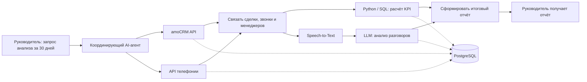

# CityCar - тестовое задание AI Automation Engineer / AI Agent Developer

## Ситуация

Руководитель пишет системе: «Проанализируй работу отдела продаж за последние 30 дней».

Источники данных:
- amoCRM: сделки и задачи;
- телефония: записи звонков.

## 1. Архитектура решения

Система получает запрос руководителя: «Проанализируй работу отдела продаж за последние 30 дней». Я бы не разделял решение на большое число агентов: достаточно одного координирующего AI-агента, который запускает сбор данных и обработку, а LLM используется для анализа разговоров и формирования итогового отчёта.

### Получение данных из amoCRM

Через API система получает сделки, задачи, статусы и ответственных менеджеров.

### Получение звонков

Через API телефонии система получает записи звонков и данные о них. После получения информации из обоих источников система связывает сделки, звонки и менеджеров.

### Обработка звонков

Записи переводятся в текст с помощью Speech-to-Text. После этого AI анализирует разговоры: определяет причины отказов, возражения клиентов, наличие следующего шага и возможные ошибки менеджера.

### Анализ данных

Параллельно Python и SQL рассчитывают количественные показатели: количество сделок, конверсию, просроченные задачи, сделки без следующего действия и показатели по менеджерам.

### Хранение результатов

Данные CRM, транскрипты звонков, рассчитанные показатели и результаты AI-анализа сохраняются в PostgreSQL.

### Формирование отчёта

LLM-модуль объединяет рассчитанные показатели и результаты анализа звонков и формирует для руководителя итоговый отчёт:
- что произошло;
- где есть проблемы;
- какие причины могут их объяснять;
- какие сделки или менеджеры требуют внимания;
- рекомендации.

### Упрощённая схема

```text
Руководитель -> AI-агент -> amoCRM + телефония -> связывание данных -> Python/SQL + LLM -> итоговый отчёт
```

Результаты обработки сохраняются в PostgreSQL.

Ключевой принцип: числовые показатели рассчитываются обычным кодом, а LLM используется для анализа содержания звонков и подготовки понятного управленческого вывода.

### Упрощённая BPMN-схема



## 2. Что система делает сама, а что передаёт человеку

Автоматически система получает данные из amoCRM и телефонии, связывает сделки и звонки, переводит разговоры в текст, рассчитывает показатели, анализирует разговоры, выявляет проблемные сделки и формирует аналитический отчёт.

Человеку передаются решения с высоким риском: изменение критичных данных в CRM, закрытие или перевод сделки, действия в отношении клиента, кадровые решения и спорные случаи, где AI не уверен в результате.

Основной принцип: система автоматически собирает и обрабатывает данные, AI анализирует неструктурированную информацию и формирует рекомендации, а значимые бизнес-решения подтверждает человек.

### Основные риски

1. **Качество исходных данных.** Если CRM заполнена неполно или звонки неправильно связаны со сделками, выводы системы могут быть неверными.
2. **Ошибки AI-анализа.** Модель может неправильно классифицировать причины отказа или действия менеджера. Поэтому выводы должны быть привязаны к исходным данным, а спорные случаи передаваться человеку.
3. **Безопасность данных.** CRM и записи звонков содержат персональные и коммерческие данные, поэтому необходимо разграничение доступа и контроль передачи данных во внешние сервисы.

## 3. Python: сделки без задач или с просроченными задачами

Для решения использую Python и поле сделки `closest_task_at`. В API amoCRM это Unix Timestamp ближайшей задачи к выполнению. Поэтому достаточно определить:
- `closest_task_at is None` - нет текущей задачи;
- `closest_task_at < текущее время` - ближайшая задача просрочена.

Код вынесен в отдельный файл: [`amocrm_problem_leads.py`](./amocrm_problem_leads.py).

```python
import os
import time
import requests

BASE_URL = os.environ["AMO_BASE_URL"].rstrip("/")
TOKEN = os.environ["AMO_ACCESS_TOKEN"]

headers = {"Authorization": f"Bearer {TOKEN}"}
problem_leads = []
now = int(time.time())
page = 1

while True:
    response = requests.get(
        f"{BASE_URL}/api/v4/leads",
        headers=headers,
        params={"page": page, "limit": 250},
        timeout=15,
    )
    response.raise_for_status()
    data = response.json()

    for lead in data.get("_embedded", {}).get("leads", []):
        # Закрытые сделки не требуют следующей задачи
        if lead.get("status_id") in (142, 143):
            continue

        task_at = lead.get("closest_task_at")

        if task_at is None:
            problem_leads.append(
                (lead["id"], lead["name"], "нет задачи")
            )
        elif task_at < now:
            problem_leads.append(
                (lead["id"], lead["name"], "задача просрочена")
            )

    if "next" not in data.get("_links", {}):
        break

    page += 1

for lead_id, name, reason in problem_leads:
    print(f"{lead_id}: {name} - {reason}")
```

В этом примере закрытые сделки уже исключаются через системные статусы 142 и 143. Под сделкой «без задачи» я понимаю активную сделку без текущей незавершённой задачи. В production-версии я дополнительно ограничил бы выборку нужными воронками и этапами, а при необходимости использовал бы `/api/v4/tasks` для получения деталей конкретных задач.

## 4. Реальный AI-проект

Один из моих текущих проектов - локальная инфраструктура для работы с LLM и их сравнительного тестирования.

**Проект BULL:** [GitHub - MrChronon/bull](https://github.com/MrChronon/bull)

**Задача:** развернуть локальные модели на отдельной рабочей станции и использовать их с ноутбука как удалённый AI-сервис для чата и AI-assisted разработки, без необходимости запускать модель на клиентском устройстве.

**Стек:** Ollama, REST API, SSH, Git/GitHub, локальные LLM, собственный бенчмарк BULL 25.

**Архитектура:** модель работает на отдельном компьютере, а ноутбук подключается к ней по API через SSH-туннель. Клиентские инструменты обращаются к этому API как к внешнему LLM-сервису. Для выбора моделей я сравниваю их по качеству ответов, скорости генерации и требованиям к памяти.

**Что сделал самостоятельно:** настроил локальный inference, удалённый API-доступ, сетевое подключение и SSH-туннель, протестировал несколько моделей и конфигураций, настроил сравнительное тестирование BULL 25 и подобрал разные модели под чат и задачи программирования.

**Результат:** получил рабочую локальную AI-инфраструктуру, которой можно пользоваться с другого устройства, и воспроизводимый процесс выбора модели под конкретную задачу.

Сейчас это R&D-система. Для production-эксплуатации я бы добавил мониторинг, обработку отказов, управление доступом и дополнительные требования к безопасности данных.

## 5. Чему научился самостоятельно за последние полгода и где применил

За последние полгода я заметно углубился в Python, работу с API и локальными LLM. Самостоятельно изучал развёртывание моделей через Ollama, удалённый доступ к ним по API, SSH-туннели, настройку AI-assisted разработки и сравнительное тестирование моделей.

Эти знания применил в собственном проекте Local LLM, где настроил отдельную машину для inference, удалённый доступ к моделям с ноутбука и систему сравнительного тестирования BULL 25.

Параллельно развивал SQL и аналитику данных: работал с pandas, обработкой и проверкой данных, расчётом показателей и статистическим анализом. Эти навыки использовал в учебных аналитических проектах и в работе с реальными табличными данными.

За этот период я перешёл от использования готовых AI-инструментов к самостоятельной настройке LLM-инфраструктуры и интеграций: понимаю, как модель получает данные, как внешние приложения обращаются к ней по API, как сравнивать качество и выбирать решение под конкретную задачу.

## 6. Пример улучшения, которое предложил и довёл до результата

В небольшой компании, где я занимался IT-поддержкой, я предложил внедрить CRM Битрикс24 для управления задачами и внутренними рабочими процессами.

До этого часть взаимодействия и контроля задач была распределена между чатами и отдельными инструментами, из-за чего было сложнее отслеживать ответственность и статус работы.

Я самостоятельно изучил возможности системы, предложил вариант использования, настроил структуру компании и пользователей, права доступа и иерархию, провёл презентацию для сотрудников и помогал решать возникающие вопросы после запуска.

В результате CRM была внедрена в рабочий процесс компании и стала использоваться как единое пространство для постановки и контроля задач.

Для меня этот пример важен тем, что я не просто выполнял поставленную техническую задачу, а сначала увидел проблему в процессе, предложил решение и затем сам довёл его до внедрения.
